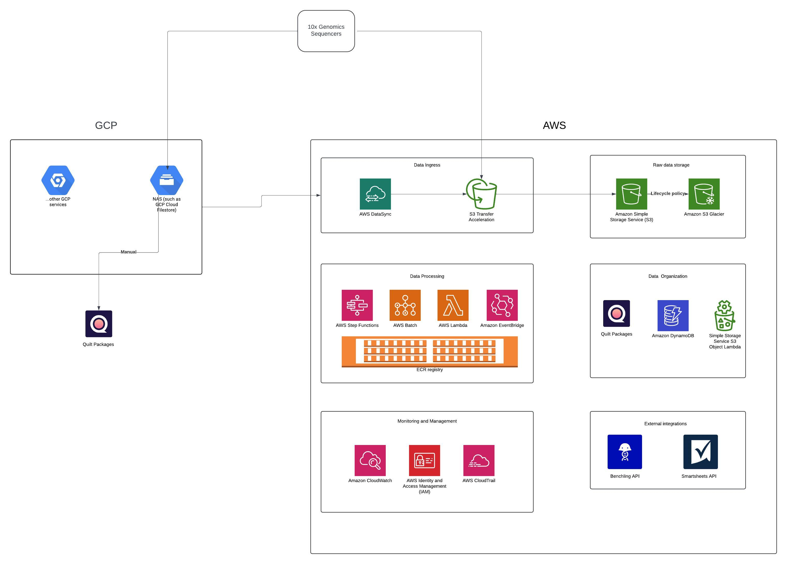
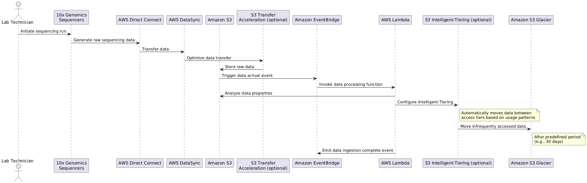
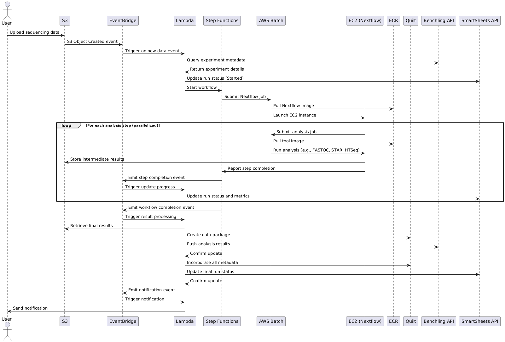

# AWS Pipeline Infrastructure Documentation

## Table of Contents
1. [Introduction](#introduction)
2. [Architecture Overview](#architecture-overview)
3. [Data Processing Flow](#data-processing-flow)
4. [Data Organization](#data-organization)
5. [External Integrations](#external-integrations)
6. [Monitoring and Management](#monitoring-and-management)
7. [Service Choices and Alternatives](#service-choices-and-alternatives)
8. [Challenges and Optimizations](#challenges-and-optimizations)
9. [Cost Estimation](#cost-estimation)

## Introduction

This document outlines the AWS-based genomics pipeline architecture for GeneXOmics, designed to address their need for a scalable, efficient, and reliable system for processing genomic sequencing data.

## Architecture Overview

The architecture leverages various AWS services to create a robust, scalable, and automated genomics pipeline. The diagram shows current pipeline architecture on GCP and which AWS services can be used instead for data transfer, organization and processing. These particular flows are outlined below.

## Data Transfer (Ingress)

The data ingress process is crucial for efficiently moving large volumes of genomic data from on-premises sequencers to the AWS cloud infrastructure. For GeneXOmics, we've chosen to implement AWS DataSync as the primary data transfer solution.

1. **10x Genomics Sequencers**
   - Generate raw sequencing data on-premises
   - Output formats typically include FASTQ or BCL files

2. **AWS DataSync**
   - Automates and accelerates data transfer between on-premises and AWS
   - Can work over public internet or Direct Connect (if implemented in the future)
   - Chosen for the following reasons:
     1. Scalability: Easily handles the 140-190 GB of weekly data generated by the sequencers.
     2. Automation: Can be scheduled to run automatically, reducing the need for manual intervention - a key goal for GeneXOmics.
     3. Data integrity: Includes automatic data validation, ensuring the integrity of the sensitive genomic data during transfer.
     4. Flexibility: Can work over the internet or Direct Connect, giving GeneXOmics options as they scale.
     5. Ease of setup: For a rapidly growing company, DataSync's simpler setup process is advantageous.
     6. Cost-effectiveness: For the current data volume (about 1.1TB per month), DataSync is likely more cost-effective than maintaining a dedicated Direct Connect line.

3. **Amazon S3 (Destination)**
   - Serves as the primary storage for incoming raw sequencing data
   - Implements S3 Intelligent-Tiering for automatic cost optimization

4. **Amazon EventBridge**
   - Triggers Lambda functions upon successful data ingress
   - Enables real-time processing and workflow initiation

5. **AWS Lambda**
   - Performs initial data validation and metadata extraction
   - Initiates the genomic analysis pipeline via Step Functions

Data Flow:
1. Sequencing data is generated by 10x Genomics Sequencers on-premises.
2. AWS DataSync transfers the data to Amazon S3, handling scheduling, validation, and optimization - removing manual work.
3. Upon successful transfer, S3 triggers an EventBridge event.
4. EventBridge invokes a Lambda function to process the newly arrived data.
5. Lambda function initiates the analysis pipeline and configures S3 Intelligent-Tiering (optional - possible cost optimization).

Key Benefits:
- Reliable and fast data transfer with minimal on-premises management
- Automated transfer process reduces manual intervention and potential errors
- Scalable to handle increasing data volumes as GeneXOmics grows

## Data Processing Flow

1. **AWS Batch**
   - Runs containerized Nextflow pipeline for genomic analysis
   - Executes analysis stages: quality control, read alignment, gene expression quantification
   - AWS Batch allows for dynamic scaling, so we can configure it to automatically select larger instances for jobs with higher resource requirements
   - Example workflow: FASTQC for QC → STAR aligner for read mapping → featureCounts for gene quantification

2. **AWS Step Functions**
   - Orchestrates the entire workflow
   - Manages state transitions and error handling
   - Typical workflow steps:
     1. Trigger data transfer from S3 to EC2 instances
     2. Start AWS Batch job for quality control
     3. Check QC results and decide whether to proceed
     4. Start AWS Batch job for read alignment
     5. Start AWS Batch job for gene quantification
     6. Trigger result upload to S3
     7. Initiate Quilt package creation
     8. Update metadata in DynamoDB

3. **AWS Lambda**
   - Triggers Step Functions workflow on new data arrival in S3
   - Performs lightweight data transformations
   - Integrates with Benchling and SmartSheets APIs
   - Handles event-driven tasks and notifications

4. **Amazon ECR**
   - Stores Docker images for:
     - Nextflow runtime environment
     - Analysis tools (FASTQC, STAR aligner, HTSeq)
     - Custom scripts and utilities

## Data Organization

1. **Quilt**
   - Creates versioned data packages after each pipeline run
   - Includes raw data, processed results, and associated metadata
   - Enables easy tracking of data provenance

2. **Amazon S3**
   - Primary storage for raw and processed data
   - Utilizes S3 Intelligent-Tiering for cost optimization
   - Implements S3 Object Tagging for data categorization and lifecycle management

## External Integrations

1. **Benchling Integration**
   - Lambda functions query Benchling API for experiment metadata
   - Metadata incorporated into Quilt packages
   - Pipeline results pushed back to Benchling for researcher access

2. **SmartSheets Integration**
   - Lambda functions update SmartSheets with pipeline status and summary results
   - Enables real-time tracking of sequencing runs and analysis progress

## Monitoring and Management

1. **Amazon CloudWatch**
   - Monitors CPU and memory usage of Batch jobs
   - Tracks S3 bucket metrics
   - Sets up alarms for pipeline failures or long-running jobs
   - Centralizes logs from various services

2. **AWS IAM**
   - Defines roles with least privilege access
   - Manages user/service access to different parts of the pipeline

3. **AWS CloudTrail**
   - Logs API calls to AWS services
   - Tracks pipeline run initiations and configuration changes
   - Provides audit trail for compliance and security analysis

## Service Choices and Alternatives

1. **AWS Batch vs. Amazon ECS/EKS**
   - Choice: AWS Batch
   - Reason: Automatic resource provisioning and job queue management, ideal for batch-oriented genomic data processing
   - Alternative: Amazon ECS/EKS would require more manual configuration for batch processing

2. **AWS Step Functions vs. Apache Airflow**
   - Choice: AWS Step Functions
   - Reason: Serverless orchestration with seamless AWS service integration
   - Alternative: Apache Airflow would require more setup and maintenance

3. **Amazon S3 vs. Amazon EFS**
   - Choice: Amazon S3 with Intelligent-Tiering
   - Reason: Cost-effective for large-scale data storage with automatic tiering
   - Alternative: Amazon EFS would be more suitable for high-performance shared file system needs but at a higher cost

4. **AWS DataSync vs. AWS Direct Connect**
   - Choice: AWS DataSync
   - Reasons:
     * Scalability: Easily handles GeneXOmics' current data volume (1.1TB/month)
     * Automation: Reduces manual intervention in data transfer processes
     * Data integrity: Provides built-in validation for sensitive genomic data
     * Flexibility: Can work over the internet or Direct Connect if needed in the future
     * Ease of setup: Simpler to implement for a rapidly growing company
     * Cost-effectiveness: More economical for current data volumes
   - Alternative: AWS Direct Connect
     * Would provide dedicated network connection from on-premises to AWS
     * Better suited for consistently high data transfer volumes (typically >100TB/month)
     * Offers more predictable network performance
     * Higher initial setup cost and ongoing fees
     * Could be considered in the future if data transfer volumes significantly increase

## Challenges and Optimizations

1. **Migration from GCP to AWS**
   - Implement infrastructure as code using AWS CloudFormation or Terraform
   - Utilize AWS Application Migration Service for existing applications if needed
   - Implement multi-region strategy for increased availability

2. **Increased Robustness and Reliability**
   - Use S3 event notifications to trigger Lambda functions
   - Implement dead-letter queues for failed processing attempts
   - Use CloudWatch alarms for pipeline health monitoring

3. **Fast Processing Times**
   - Leverage AWS Batch for automatic scaling of compute resources
   - Use S3 Transfer Acceleration for faster data uploads
   - Implement parallel processing in Nextflow pipeline

## Cost Estimation

Based on the provided metrics:
- 4 sequencers
- 8 sequencing runs per week
- 140GB to 190GB of data weekly (1.1TB per month)

Estimated monthly costs:

1. **Amazon S3 Storage**
   - New data per month: 1.1TB * $0.023/GB/month = $25.30
   - Cumulative storage (assuming 6 months of data retention):
     6.6TB * $0.023/GB/month = $151.80

2. **Data Transfer**
   - Assume 10% of data transferred out: 110GB * $0.09/GB = $9.90
   - Note: "Data transferred out" refers to data leaving AWS, such as researchers downloading results or sharing data with external collaborators. 10% is an estimate and may vary based on actual usage patterns.

3. **AWS Batch Compute**
   - Based on typical genomic pipeline requirements:
     Assume 10 hours of compute time per run on c5.2xlarge instances
   - 10 hours * 8 runs * 4 weeks * $0.34/hour = $108.80
   - Note: c5.2xlarge (8 vCPU, 16 GiB memory) chosen based on typical genomic workflow requirements:
     * Balanced CPU to memory ratio suitable for most genomic tasks
     * Provides enough resources to handle medium-sized genomic datasets
     * Cost-effective compared to larger instances for the expected workload
   - Consider monitoring resource utilization and adjusting instance type if needed dynamically through AWS Batch (e.g., c5.xlarge for lighter workloads or c5.4xlarge for more demanding analyses, or for memory-intensive steps like genome assembly, consider using memory-optimized instances - r5 or x1 families, for specific tasks within the pipeline)

4. **AWS Step Functions**
   - 32 executions per month * 100 state transitions * $0.000025/transition = $0.08
   - Note: 100 state transitions per execution is a rough average for a genomic workflow, which typically includes steps for quality control, alignment, variant calling, and result processing. Actual number may vary based on pipeline complexity.

5. **AWS Lambda**
   - Assume 100 invocations per run, 256MB memory, 30 seconds average duration
   - 25,600 invocations * (30 seconds * $0.0000000417/GB-second) = $0.32
   - Note: 100 invocations per run is an estimate based on typical genomic pipeline needs, such as triggering workflow steps, processing metadata, and handling notifications. Actual usage may vary depending on pipeline design and integration requirements.

6. **Amazon ECR**
   - Storage: 5GB * $0.10/GB/month = $0.50

7. **Amazon CloudWatch**
   - Assume 5GB of logs per month: 5GB * $0.50/GB = $2.50

8. **AWS DataSync**
   - 1.1TB transferred per month * $0.0125/GB = $13.75

Total Estimated Monthly Cost: $287.65

Note: This is a rough estimate and actual costs may vary based on usage patterns and data access frequencies. 

Cost Optimization Notes:
- S3 Intelligent-Tiering not included in this estimate but can provide savings for data with changing access patterns.
- EC2 Spot Instances with AWS Batch can offer potential savings of up to 70% on compute costs.
- Implement S3 Lifecycle policies to move older data to Glacier for long-term storage savings.

